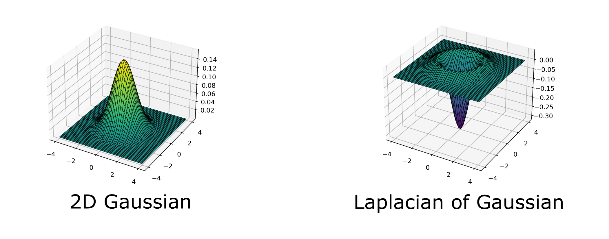
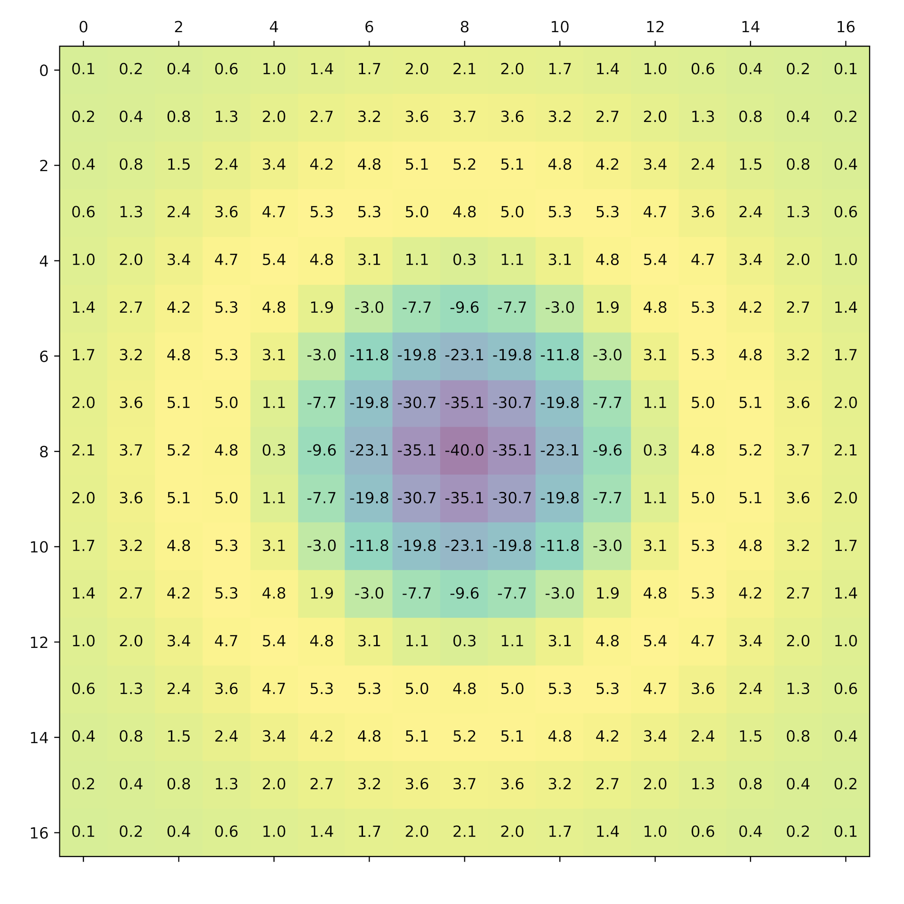

# Image sharpening program

Images can be fuzzy from random noise and blurrings.

A image can be sharpened by:  

  1. detecting the edges  
  2. combining the edges with the original image  

These steps are shown in figure 1.
<!-- <figure markdown> -->
{: style="width:500px;height:auto"}

*Figure 1. Image sharpening steps.*

<!-- <figcaption> Image sharpening procedure</figcaption> -->
<!-- </figure> -->

## Edge detection

Edges can be detected using a Laplacian filter. The Laplacian $L(x,y)$ is the second spatial derivative of the image intensity $I(x,y)$, this means it highlights regions of rapid intensity change, i.e the edges.

\( 
L(x,y) = \frac{\partial^2 I }{\partial x^2} +  \frac{\partial^2 I }{\partial y^2}
\)

In practice this detects noise in the image as edges, therefore a smoothing filter is applied first which takes the form of a Guassian. The Guassian filter $G(x,y)$ approximates each pixel as a weighted average of its neighbors.

\( 
G(x,y) = \frac{1}{2 \pi \sigma^2} e^{- (x^2+y^2)/(2 \sigma^2)}   
\)

The two operations can be combined to give the Laplacian of Gaussian filter $LoG(x,y)$.

\(
LoG(x,y) = -\frac{1}{\pi \sigma^4} \left( 1 -  \frac{x^2+y^2}{2 \sigma^2}\right)  e^{- (x^2+y^2)/(2 \sigma^2)}
\)

These two fuctions $G(x,y)$ and $LoG(x,y)$ are graphed in figure 2.

{: style="width:500px;height:auto"}

*Figure 2. Gaussian and Laplacian of Gaussian filters*

## Implementation

To apply the LoG filter to an image the LoG filter must be turned into a discrete mask, that is a matrix of size 2d+1 x 2d+1 where d is an integer. We use d=8, therefore the LoG filter is a 17x17 square, it looks like this:

{: style="width:500px;height:auto"}

*Figure 3. LoG filter as a discerete mask*

To perform the convolution of this filter with original image the following operation is performed on each pixel

\(
edges(i,j) = \sum_{k=-d}^d \sum_{k=-d}^d  image(i + k, j + l) \times filter(k,l)
\)

The sharpened image is then created by adding the edges to the original image, with a scaling factor (See the source code for the full details).