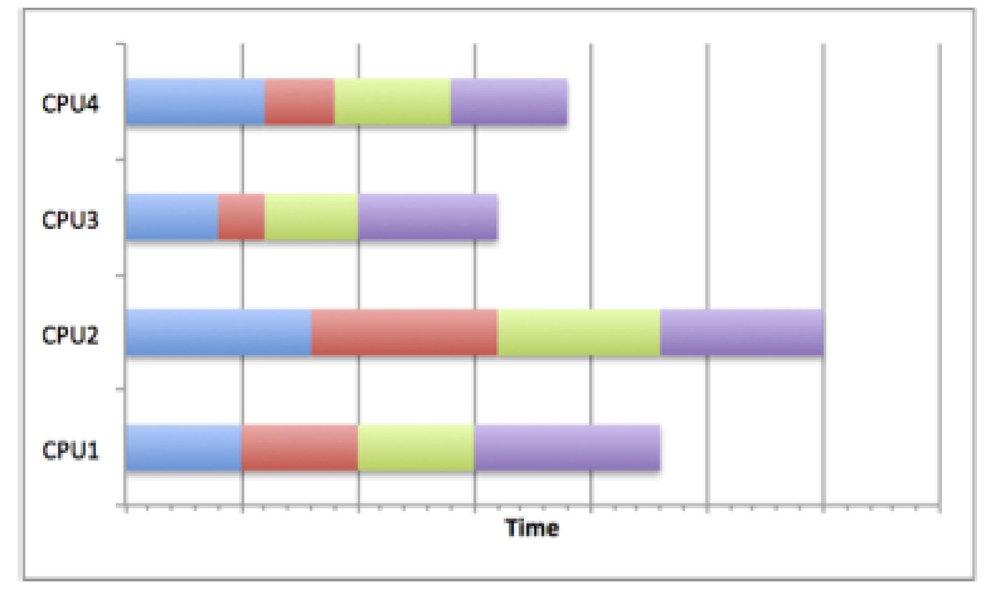
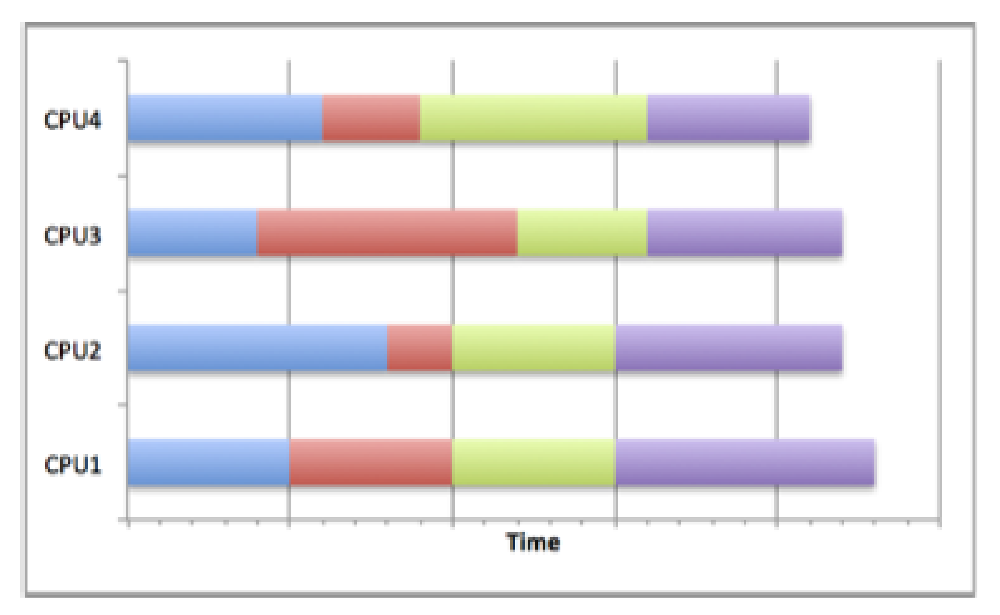

# Fractal calculation program


## Mandelbrot Set

The Mandelbrot set is a famous example of a fractal in mathematics. It is a set of complex numbers $c$ for which the function 

$f_c(z) = z^2 + c$

does not diverge to infinity when iterated from $z=0$, i.e the values of $c$ for which the sequence 

$[ c,\ c^2+c,\ (c^2+c)^2+c,\ ((c^2+c)^2+c)^2+c,\ ...]$ 

remains bounded.

The complex numbers can be thought of as 2d coordinates, that is a complex number $z$ with real part $a$ and imaginary part $b$ ($z = a + ib$) can be written as $(a, b)$. The coordinates can be plotted as an image, where the color corresponds to the number of iterations required before the escape condition is reached. The escape condition is when we have confirmed that the sequence is not bounded, this is when the magnitude of $z$, the current value in the iteration, is greater than 2.

The pseudo code for this is

``` python
for each x,y coordinate 
    x0, y0 = x, y
    x = 0
    y = 0
    iteration = 0
    while (iteration < max_iterations and x^2 + y^2 <= 4 )
        x_next = x^2+y^2 + x0
        y_next = 2*x*y + y0

        iteration = iteration + 1

        x = x_next
        y = y_next

    return color_map(iteration)

```
Note that for points within the Mandelbrot set
the condition will never be met, hence the need to set the upper bound ``max_iterations``.

The Julia set is another example of a complex number set.


From the parallel programming point of view the useful feature of the Mandelbrot and Julia sets is that the calculation for each point is independent i.e. whether one point lies within the set or not is not affected by other points.


## Parallel Programming Concepts

## Task farm

Task farming is one of the common approaches used to parallelise applications. Its main idea is to automatically create pools of calculations (called tasks), dispatch them to the processes and the to collect the results. 

The process responsible for creating this pool of jobs is known as a **source**, sometimes it is also called a *master* or *controller process*. 

The process collecting the results is called a **sink**. Quite often one process plays both roles – it creates, distributes tasks and collects results. It is also possible to have a team of source and sink process. A ‘farm’ of one or more workers claims jobs from the source, executes them and returns results to the sink. The workers continually claim jobs (usually complete one task then ask for another) until the pool is exhausted.

Figure 1 shows the basic concept of how a task farm is structured.


{: style="width:500px;height:auto"}

*Figure 1. Schematic representation of a simeple task farm.

In summary processes can assume the following roles:
-   **Source** - creates and distributes tasks
- **Worker processes** - complete tasks received from the source process
and then send results to the sink process
- **Sink** - gathers results from worker processes.

Having learned what a task farm is, consider the following questions:
 - What types of problems could be parallelised using the task farm approach? What types of problems would not benefit from it? Why?
- What kind of computer architecture could fully utilise the task farm benefits? 


### Using a task farm

As you may have guessed a task farm is commonly used in large
computations composed of many independent calculations. Only when
calculations are independent is it possible to assign tasks in the most effective
way, and thus speed up the overall calculation with the most efficiency. After
all, if the tasks are independent from each other, the processors can request
them as they become available, i.e. usually after they complete their current
task, without worrying about the order in which tasks are completed. 

This dynamic allocation of tasks is an effective method for getting more use
out of the compute resources. It is inevitable that some calculations will take
longer to complete than others, so using methods such as a lock-step
calculation (waiting on the whole set of processors to finish a current job) or
pre-distributing all tasks at the beginning would lead to wasted compute
cycles.
Of course, not all problems can be parallelised using a task farm approach.


### Not always a task farm

While many problems can be broken down into individual parts, there are a
sizeable number of problems where this approach will not work. Problems
which involve lots of inter-process communication are often not suitable for
task farms as they require the master to track which worker has which
element, and to tell workers which other workers have which elements to
allow them to communicate. Additionally, the sink progress may need to
track this as well in cases of output order dependency.
It is possible to use task farms to parallelise problems that require a lot of
communications, however, in such cases drawbacks and overheads
impacting the performance would be incurred.
As mentioned before, to determine the points lying within the Mandelbrot set
there is no need for the communications between the worker tasks, which
makes it an embarrassingly parallel problem that is suitable for task-farming.
Although the calculation can employ the task farm approach, we still need to
consider how to use it in the most optimal way. 

Consider the following scenarios:
-  How do you think the performance would be affected if you were to use
more, equal and fewer tasks than workers?
- In your opinion what would be the optimal combination of the number
of workers and task? What would it depend on the most? Task size?
Problem size? Computer architecture? 


## Load Balancing

The factor deciding the effectiveness of a task farm is a task distribution. A
way in which a master process determines how the tasks are distributed
across the workers it called a load balancing.

A successful load balancing will avoid overloading a single worker,
maximising the throughput of the system and making best use of resources
available. Poor load balancing will cause some workers of the system to be
idle and consequently other elements to be ‘overworked’, leading to increased
computation time and significantly reduced performance. 


### Poor load balancing

Figure 2 shows how careless task distribution can affect the completion time.
Clearly, CPU2 needs more time to complete its tasks, particularly compared
to CPU3. The total runtime is equivalent to the longest runtime on any of the
CPUs so the calculation time will be longer than it would be if the resource
were used optimally. This can occur when load balancing is not considered,
random scheduling is used (although this is not always bad) or poor decisions
are made about the job sizes. 

{: style="width:500px;height:auto"}

*Figure 2. Poor load balance*

### Good Load Balancing


Figure 3 shows how by scheduling jobs carefully, the best use of the
resources can be made. By choosing a distribution strategy to optimise the
use of resources, the CPUs in the diagram all complete their tasks at roughly
the same time. This means that no one task has been overloaded with work
and dominated the running time of the overall calculation. This can be
achieved by many different means.

For example, if the task sizes and running times are known in advance, the
jobs can be scheduled to allow best resource usage. The most common
distribution is to distribute large jobs first and then distribute progressively
smaller jobs to equal out the workload.

If the job sizes can change or the running times are unknown, then an
adaptive system could be used which tries to infer future task lengths based
upon observed runtimes. 

{: style="width:500px;height:auto"}

*Figure 3. Good load balance.*

The fractal program you will be using employs a queue strategy – tasks are queued waiting for workers, which completed their previous task, to claim them from the top of the queue. This ensures that workers that happen to get shorter tasks will complete more tasks, so that they finish roughly at the same time as workers with longer tasks.

### Quantifying the load imbalance

We can try to quantify how well balanced a task farm is by computing the load imbalance factor, which we define as:

\(
\text{load imbalance factor} = \frac{\text{Workload of most loaded worker}}{\text{average workload of workers}}
\)

For a perfect load-balanced calculation this will be equal to 1.0, which is equivalent to all workers having exactly the same amount of work. In general, it will be greater than 1.0.
It is a useful measure because it allows you to predict what the runtime would be for a perfectly balanced load on the same number of workers, assuming that no additional overheads are introduced due to load balancing. For example, if the load imbalance factor is 2.0 then this implies that, in principle, we could halve the runtime (reduce it by a factor of 2) if the load were perfectly balanced.
