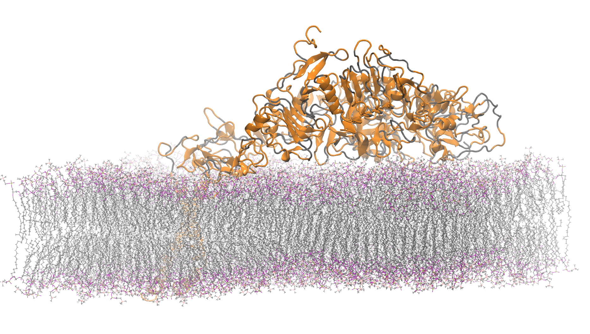

# Part 1

In this section you will run a benchmark simulation and investigate the strong scaling parallel performance.


## The benchmark system

The system we will used from the HECBIOSIM bechmark suite:
https://www.hecbiosim.ac.uk/access-hpc/benchmarks

We will focus on the 465K atom system:

465K atom system - hEGFR Dimer of 1IVO and 1NQL
- Total number of atoms = 465,399
-   Protein atoms = 21,749  Lipid atoms = 134,268  Water atoms = 309,087  Ions = 295


{: style="width:500px;height:auto"}

The input file can be obtained from https://www.hecbiosim.ac.uk/access-hpc/benchmarks, or from our git repo: TODO


## Running the benchmark

--8<-- "machine_specific/ex3_part1_running.md"


The bottom of the ``md.log`` file will contain the performance timings, e.g:

```bash
               Core t (s)   Wall t (s)        (%)
       Time:    12283.520       95.966    12799.9
                 (ns/day)    (hour/ns)
Performance:       18.008        1.333
```

The most useful numbers to us are the wall-time ``95.966s`` , and the performance: ``18.008 ns/day`` which tells us how much simulation time (in nano-seconds) can be simulated for 1 day of wall-clock time.

## Things to investigate
- You should vary the number of nodes of plot the performance. This investigates the strong scaling of the program.
- What node count would you use for a long production simulation?
- Previous benchmarks for this system can be found here:
https://www.hecbiosim.ac.uk/access-hpc/our-benchmark-results/archer2-benchmarks

We have plotted our results for version 2021.3 of gromacs on ARCHER2 here:

{: style="width:500px;height:auto"}


