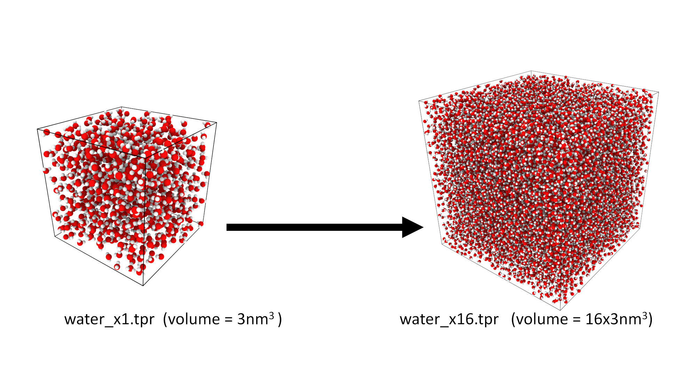

# Part 2

In this section you will use a different benchmark system and investigate the weak scaling parallel performance.

## The benchmark system

The benchmark system we will use to investigate the weak scaling is a box of water. This is a simple system than can be created for different system sizes.

The initial box size is 5nm x 5nm x 5nm and contains 884 water molecules. We have provided input files for this system ``water_x1.tpr`` and multiple larger systems with 2, 4, 8, ... up to 8096 times the volume (``water_x2.tpr``, ``water_x4.tpr``, ``water_x8.tpr``, ... , ``water_8096.tpr``).

{: style="width:500px;height:auto"}

## Running the benchmark

The benchmarks are designed such that ``water_x1.tpr`` is a suitable size for running on 1 core. (GROMACS works best with ~1000 atoms per CPU)

--8<-- "machine_specific/ex3_part2_running.md"

Once again the important number is the ns/day figure.

## Things to investigate
- You should run the benchmarks systems where the number of cores used scales with the system size. I.e run ``water_x1.tpr`` with 1 core, ``water_x2.tpr`` with 2 cores, ``water_128.tpr`` with 128 cores etc. This investigates the weak scaling

- Plot the results and look at the difference between the intra-node and inter-node scaling.

We have plotted our results for version 2021.3 of GROMACS on ARCHER2 below:

{: style="width:500px;height:auto"}